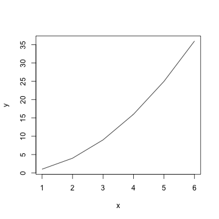

## Topics

* Intro to R
* What is Data?
* Study Design
* Prediction and modeling
* Tricks and Tunning

---
## What is R?

R is a free software programming language and a software environment for statistical computing and graphics. The R language is widely used among statisticians and data miners for developing statistical software and data analysis.
* Download R: http://www.r-project.org/
* Download R Studio: http://www.rstudio.com/
* Install the following packages: tree, randomForest, nnet, caret, e1071, kernlab
* Download R Reference Card: http://cran.r-project.org/doc/contrib/Short-refcard.pdf

---
## Examples

R's data structures include scalars, vectors, matrices, data frames and lists.


```r
x <- c(1,2,3,4,5,6)     # Vector
y <- x^2                # Square the elements of x
print(y)                # print (vector) y
```

```
## [1]  1  4  9 16 25 36
```

```r
mean(y)                 # Calculate average (arithmetic mean) of (vector)
```

```
## [1] 15.16667
```

---
## Examples

```
help(plot)              # Documentation
```


```r
plot(x,y, type="l")     # plot x, y
```



---
## Examples

```r
head(iris)              # return the first part of the Iris data frame
```

```
##   Sepal.Length Sepal.Width Petal.Length Petal.Width Species
## 1          5.1         3.5          1.4         0.2  setosa
## 2          4.9         3.0          1.4         0.2  setosa
## 3          4.7         3.2          1.3         0.2  setosa
## 4          4.6         3.1          1.5         0.2  setosa
## 5          5.0         3.6          1.4         0.2  setosa
## 6          5.4         3.9          1.7         0.4  setosa
```

```r
var <- iris$Species     # assign Species column to var
print(iris[1,2])        # print the element of 1 row and 2 column
```

```
## [1] 3.5
```

---
## for() loop vs lapply, sapply, aggregate, split

```r
iris[iris$Sepal.Length < 5, 1:3] <- iris[iris$Sepal.Length < 5, 1:3] * 2
mtcars_subs <- mtcars[mtcars$am == 1, ]
aggregate(mpg ~ cyl, data=mtcars_subs, FUN=mean)
```

```
##   cyl      mpg
## 1   4 28.07500
## 2   6 20.56667
## 3   8 15.40000
```


```r
sapply(split(mtcars_subs$mpg, mtcars_subs$cyl), mean)
```

```
##        4        6        8 
## 28.07500 20.56667 15.40000
```

---
## What is Data?

### Quantitative and Continuous

```r
temperature <- c(36.6, 37.23, -12.3124)
```
### Quantitative and Discrete

```r
dice <- c(1,2,3,4,5,6)
```
### Qualitative

```r
colors <- as.factor(c("red", "blue", "gray", "yellow", "gray","blue"))
levels(colors)
```

```
## [1] "blue"   "gray"   "red"    "yellow"
```

---
## Study Design

1. Question
2. Define the ideal data set
3. Find the data
4. Clean it
5. Explore the data
6. Prediction and modeling
7. Interpretation of results

---
## Question

Can we use data collected by smartphone to predict human motions?
* Walking
* Walking upstairs
* Walking downstairs
* Sitting
* Standing
* Laying

---
## Ideal Data Set

* Each var forms a column, observation is a row.
* Table stores data about one kind of observation.


---
## Find the data


1. Git: http://nikolaypavlov.github.com/r-workshop
2. Zip archive: http://bit.ly/r-workshop
3. Original: http://archive.ics.uci.edu/ml/datasets/Human+Activity+Recognition+Using+Smartphones

---
## Data Sets specs
For each record in the dataset it is provided: 
* 3-axial acceleration from the accelerometer and the estimated body acceleration
* 3-axial Angular velocity from the gyroscope
* A 561-feature vector with time and frequency domain variables
* Activity label
* An identifier of the subject who carried out the experiment. (30 volunteers)

---
## Summarizing and cleaning the data

Open code/data_summarization_and_cleaning.R
* Was the data written correctly?
```
dim(), names(), nrow(), ncol(), head(), tail()
```

* Does R recognized the var type correctly?
```
class(), str(), as.factor(), as.numeric(), options(stringsAsFactors=F)
```

* What are the values that qualitative var takes?
```
unique(), levels()
```
Note: specify a working dir by running `setwd()` command.

---

* How many vars do you have?
```
length()
```

* Are the values inside expected ranges?
```
quantile()
```

* See if some var is missing or has some logical value?
```
any()
```

* What about missing data?
```
is.na(), impute()
```

---

* Shell we fix variable names?
```
names(), tolower(), sub(), gsub()
```

* Shell we apply the data transformation?
```
transform()
```

* Shell the new vars be created?
```
rbind(), cbind()
```

---
## Steps of Prediction Analysis

1. Find the right data
2. Define your error rate
3. Split data into: Training, Testing
4. On the training set pick features
5. On the training set pick prediction function
6. On the training set cross-validate
7. Apply once to test set

---
## Statistical modeling and prediction

Open code/model.R and try Random Forest, Neural Network, SVM models
* What is you benchmark model and error rate?
* Which model to choose from?
* Which activity class is harder to predict?

---
## High Bias vs High Varience tradeoff

You have selected the model, but still not satisfied with the perfomance.
What to do next?

* More training examples?
* Less features?
* More features?
* Less complex model?
* More complex model?

To answer this questions you need to find out if your model suffer from high bias or high varience.
Open code/ml_diagnostic.R

---
## Solutions: High Bias vs High Varience

* More training examples -> Fixes high varience 
* Less features -> Fixes high varience 
* More features -> Fixes high bias
* Less complex model (in terms of regularization parameter) -> Fixes high varience
* More complex model (in terms of regularization parameter) -> Fixes high bias

---
## How well does the model generalize?

### K-fold cross-validation


* Picking variables to include in a model
* Picking the type of prediction function to use
* Picking the parameters in the prediction function
* Comparing different predictors

http://www.imada.sdu.dk/~marco/DM825/

---
## Hyperparameters tunning and cross-validation

Open code/model_tunning.R and try to tune hyperparams of different models
* Can you find optimal hyperparameters?
* Which model is the best?

---
## Many Thanks to

### Jeffrey Leek for the Data Analysis course:
http://www.youtube.com/watch?v=OfgjgEXxskg&list=PLXBDYmaCbeL8efhOZS4g9W6Z3m9_hFSnT
### Kaggle.com for the awesome Spying Smartphone competition:
https://inclass.kaggle.com/c/predict-human-activity-using-smartphones
### Andrew Ng for the Machine Learning course:
https://www.coursera.org/course/ml

---
## Contacts

### Mykola Pavlov
 
* E-mail: me@nikolaypavlov.com 
* Linkedin: http://linkedin.com/in/nikolaypavlov
* Github: https://github.com/nikolaypavlov
